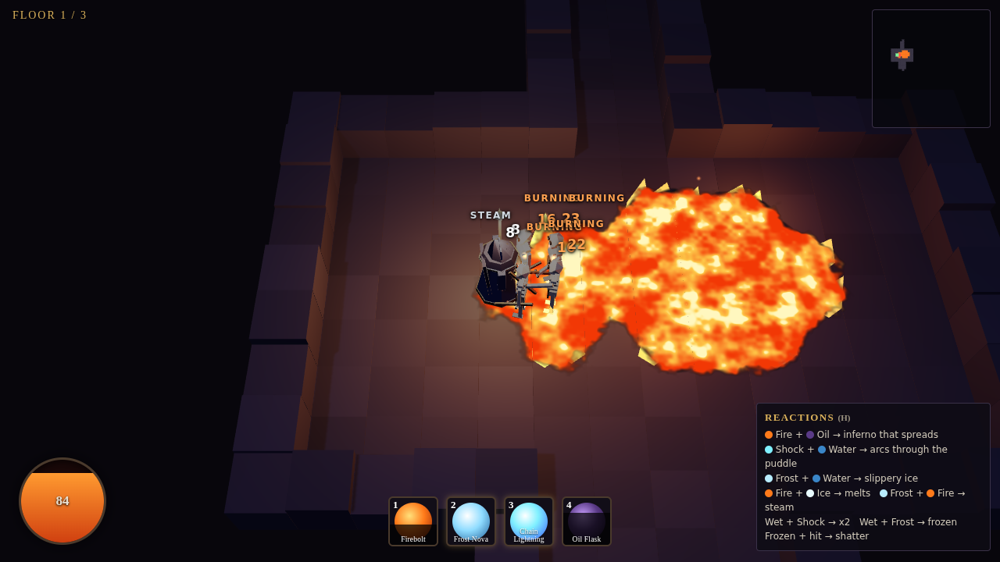
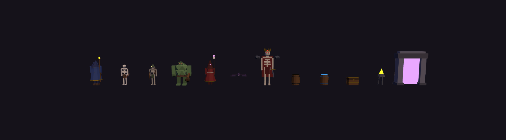

# Cinder Crypt

A small Diablo-like roguelike built around one idea: **the floor is alive.**
Oil, water, ice, fire and electricity are a tile layer that skills, monsters, barrels and loot all interact with.



## Play

No build step. Serve the folder and open it:

```bash
python3 -m http.server 8000     # then open http://localhost:8000
```

| Input | Action |
|---|---|
| Hold **left mouse** (or WASD) | Move; click a monster or barrel to fight it (staff strike) |
| **1** Firebolt · **2** Frost Nova · **3** Chain Lightning · **4** Oil Flask | Skills (right-click also fires Firebolt) |
| **I** | Inventory (click to equip, right-click to discard) |
| **H** | Toggle the reaction list · **Shift** hold position |

Three floors, then the Grave King. Each crypt is generated from a seed. Death is permanent.

## The surface reactions

| Combo | Result |
|---|---|
| Fire + Oil | Burns and spreads along the oil. Oil-soaked creatures burn longer and harder. |
| Fire + Water | Fizzles into steam (douses a burning creature). Oil floating on water still burns. |
| Fire + Ice | Melts back to water. |
| Frost + Water | Turns to ice. Creatures slide on it (momentum, low control). |
| Frost + Fire | Extinguished. |
| Shock + Water | Arcs through the whole connected puddle. Wet creatures take x2 and pass it on to other wet creatures. |
| Wet + Frost | Frozen solid. Any physical hit on a frozen creature shatters it (x2.2). |

Monsters use these rules too:
* **Enemies route around flames and live puddles** and won't wade through oil next to a fire.
* **Burning enemies panic and run for the nearest water**, which is a great place to zap them.
* **Tar Shamans** lob oil on you, then hit you with an ember bolt if you're standing in it.
* **Champions** leak oil, burn everything they touch, or zap you from range.
* Loot affixes plug into the same rules: `+dmg to Burning/Wet/Frozen`, `ignite on hit`, `leaves a trail of oil`, `never slip on ice`, and more.

## How it's built

* **Characters and props are hand-modelled in Blender** (`tools/blender/make_models.py`, run headless with `bpy`). 7 characters + 5 props, exported as `.glb` to `assets/models/`. Limbs are separate pivot nodes so the game animates them procedurally (walk cycles, swings, casts, death) with no baked clips.
* **Three.js** (vendored in `vendor/`) renders it. The surface layer is two data textures drawn by one shader: no per-tile meshes.
* **Everything else is procedural:** dungeon layout (`js/dungeon.js`), surface simulation (`js/surfaces.js`), loot (`js/loot.js`), sound (`js/audio.js` synthesises every effect with WebAudio).

```
index.html, css/          page + HUD styling
js/dungeon.js             seeded room + corridor generator
js/surfaces.js            oil / water / ice / fire / electricity rules (pure data, no rendering)
js/game.js                hero, skills, monster AI, status effects, projectiles, props, loot
js/world.js               renderer, surface shader, flames, lights, particles
js/models.js              .glb loading + procedural limb animation
js/loot.js  js/ui.js  js/audio.js  js/main.js
tools/blender/            model generator (bpy);  tools/preview.html = model lineup viewer
```

Regenerate the models: `pip install bpy==4.2.0 && python3 tools/blender/make_models.py`


