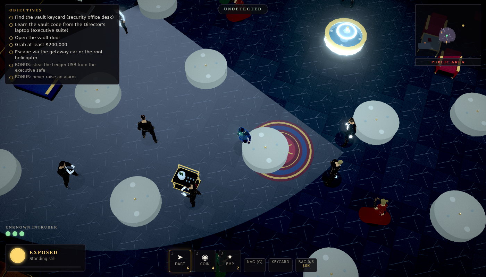
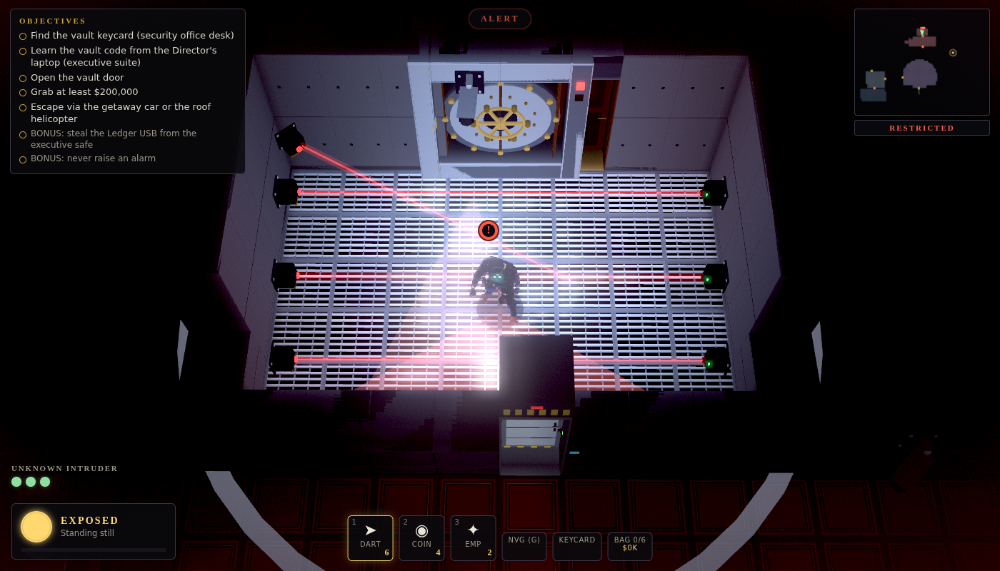
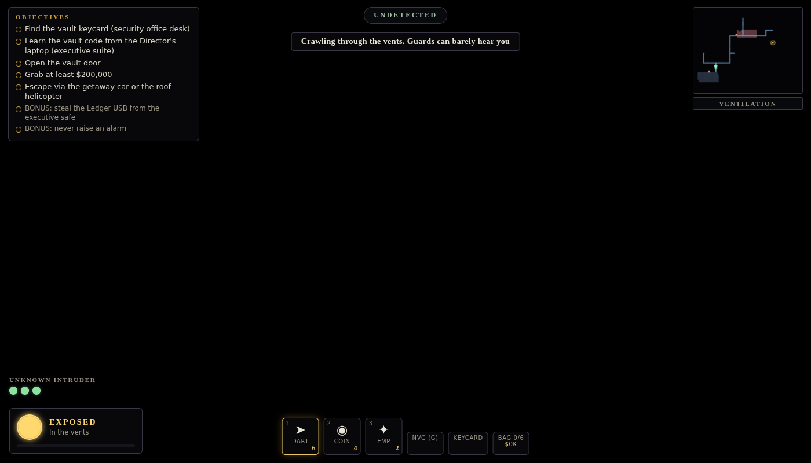

# Ghost Ledger

A top-down (rotatable camera) modern-noir stealth heist that runs in the browser. Break into a gala-night private bank, steal $200k+ from the vault, and get out — non-lethally.

## Play
Static site, no build step. Serve the repo root (`python3 -m http.server`) and open `index.html`, or use GitHub Pages (workflow in `.github/workflows/pages.yml`).
`?seed=N&go=1` jumps straight into a given contract.

## Controls
| Desktop | Action |
|---|---|
| WASD | Move · **Shift** run · **C** crouch · **Space** jump/slide |
| **F** | Context action (pick lock, hack, takedown, pickpocket, vent, loot…) |
| 1–3 / click | Dart pistol · coin distraction · EMP |
| G | Night vision · **Q/E** rotate camera · **M** mute · **V** fullscreen · Esc pause |

Mobile: floating joystick, context ACTION button, crouch/run/gadget/fire/NVG buttons, two-finger twist/pinch camera.

## Mechanics
- **Real lighting = real visibility.** A CPU light field with shadows lights every surface *and* drives guard perception. Shoot out lamps, trip breakers, stay in the dark.
- **Guards** patrol, hear, investigate, search, alert; **cameras** sweep; **laser grids** have high/mid/low beams and static/blink/sweep patterns (crouch, slide, jump).
- **Social stealth:** steal uniforms (waiter, staff, exec…) — each zone (public/staff/restricted/vault) has different rules, and witnesses notice bodies and trespassing. A **cover meter** drains when you loiter near people, run/crouch/carry in uniform, stand somewhere the uniform isn't allowed, or meet someone who knows it. At zero your cover is blown until you change clothes or lie low.
- **Vents:** 20 grates and a translucent duct network you crawl through prone. You are completely undetectable (unseen and unheard) inside, and can peek into rooms through grates.
- **Non-lethal takedowns**, carry and stash bodies in lockers/dumpsters, lockdown + reinforcements if things go loud.
- **Procedural contract per seed:** who holds the keycard, where the vault code comes from, patrols, lasers, cameras. Graded S–D.
- Procedural WebAudio noir jazz, synthesized SFX.

 

## Tech & assets
Three.js r170 (vendored). All assets are CC0:
- Characters & animations: **Quaternius** Universal Base Characters, Universal Animation Library 1 & 2, Ultimate Gun Pack — assembled at runtime into modular characters (outfit swap = disguise).
- Environment kit (123 models): modelled procedurally in Blender (`tools/blender/make_env.py`).

Regenerate: `pip install bpy==4.2.0`, then `tools/blender/make_characters.py`, `tools/blender/make_env.py`, `tools/anim_strip.py`.

The earlier prototype (Cinder Crypt) lives in `legacy/cinder-crypt/`.
